# Basic CI/CD
Разработка простого **CI/CD** для проекта *SimpleBashUtils*. Сборка, тестирование, развертывание.
## Contents

1. [Настройка gitlab-runner](#part-1-настройка-gitlab-runner)  
2. [Сборка](#part-2-сборка)  
3. [Тест кодстайла](#part-3-тест-кодстайла)   
4. [Интеграционные тесты](#part-4-интеграционные-тесты)  
5. [Этап деплоя](#part-5-этап-деплоя)  
6. [Дополнительно. Уведомления](#part-6-дополнительно-уведомления)

### Part 1. Настройка **gitlab-runner**

##### Поднять виртуальную машину *Ubuntu Server 20.04 LTS*
*Будьте готовы, что в конце проекта нужно будет сохранить дамп образа виртуальной машины*

##### Скачать и установить на виртуальную машину **gitlab-runner**
Это не так просто как кажется. Если его устанавливать `sudo apt install gitlab-runner`, то у вас не будет отслеживаться jobs.
Вот как надо его устанавливать:
0. Replace ${arch} with any of the supported architectures, e.g. amd64, arm, arm64
1. curl -LJO "https://gitlab-runner-downloads.s3.amazonaws.com/latest/deb/gitlab-runner_${arch}.deb" 
2. dpkg -i gitlab-runner_<arch>.deb

##### Запустить **gitlab-runner** и зарегистрировать его для использования в текущем проекте (*DO6_CICD*)
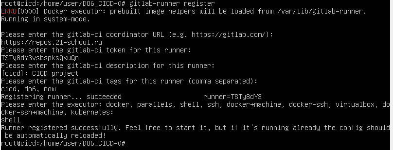

### Part 2. Сборка

#### Написать этап для **CI** по сборке приложений из проекта *C2_SimpleBashScripts*:
Для того чтобы отображался результат, необходимо сделать следующее:
    1. Подключить общую папку к VB
        1.1. `sudo apt update`
        1.2. `sudo apt install build-essential dkms linux-headers-$(uname -r)`
        1.3.  На машине нажать -> Устройства -> Подключить образ диска Дополнений гостевой ОС
        1.4. `sudo mkdir -p /mnt/cdrom`
        1.5. `sudo mount /dev/cdrom /mnt/cdrom`
        1.6. `cd /mnt/cdrom`
        1.7. `sudo ./VBoxLinuxAdditions.run --nox11`
        1.8. `reboot`
        Теперь вас папку которую вы замонтируете будет по адресу /media/${name_your_folder}
    2. Подключится к репозиторию
        2.1. У меня получилось это сделать только через root пользователя
        2.2. `sudo su root`
        2.3. `ssh-keygen`
##### В файле _gitlab-ci.yml_ добавить этап запуска сборки через мейк файл из проекта _C2_

##### Файлы, полученные после сборки (артефакты), сохранять в произвольную директорию со сроком хранения 30 дней.
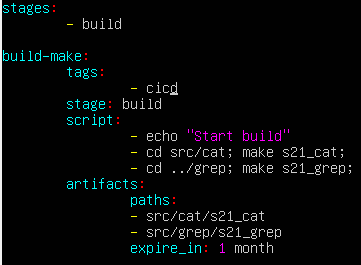

### Part 3. Тест кодстайла

**== Задание ==**

#### Написать этап для **CI**, который запускает скрипт кодстайла (*clang-format*):
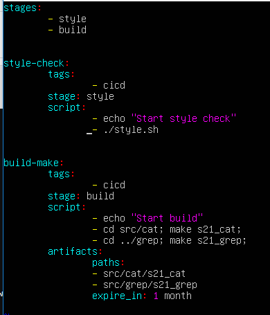
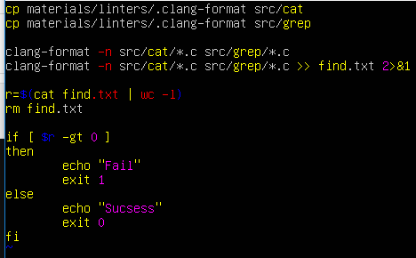

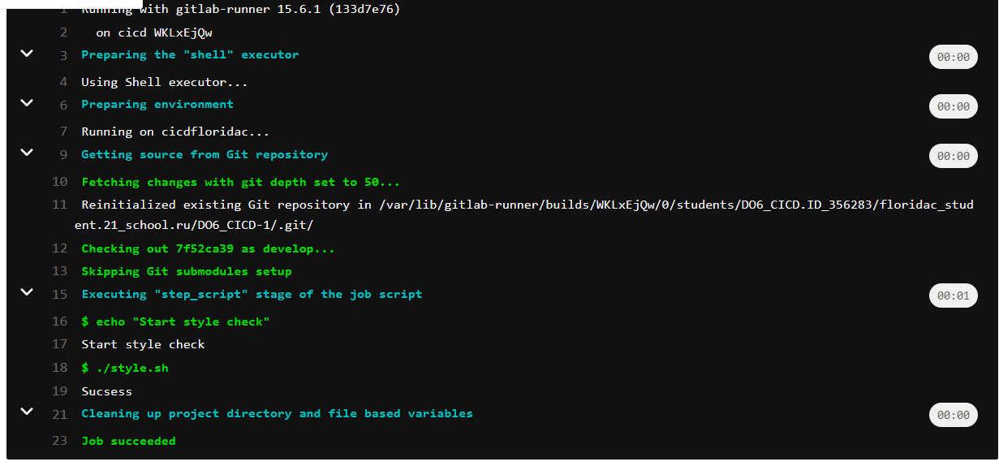
##### Если кодстайл не прошел, то "зафейлить" пайплайн
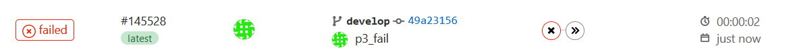
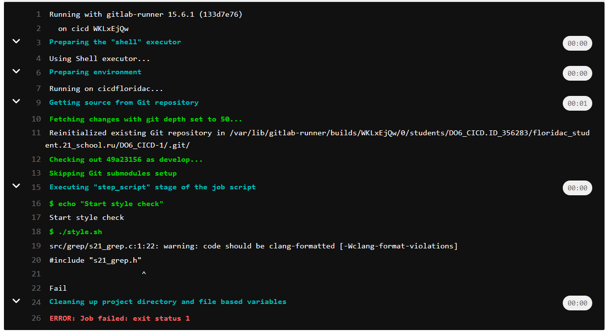
##### В пайплайне отобразить вывод утилиты *clang-format*

### Part 4. Интеграционные тесты

**== Задание ==**

#### Написать этап для **CI**, который запускает ваши интеграционные тесты из того же проекта:
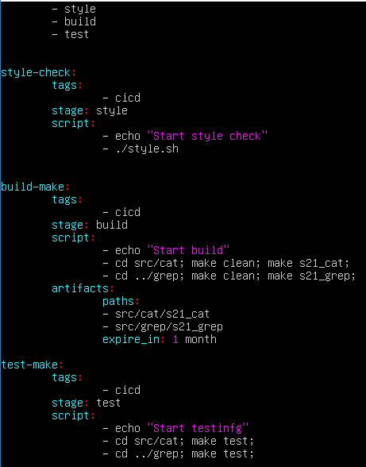
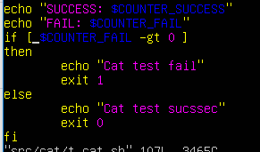
##### Запускать этот этап автоматически только при условии, если сборка и тест кодстайла прошли успешно

##### Если тесты не прошли, то "зафейлить" пайплайн

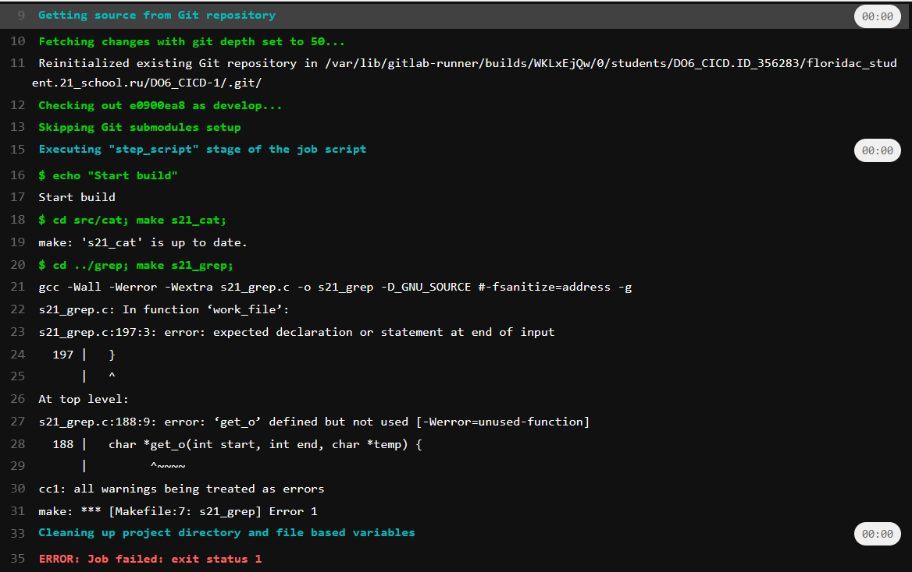
##### В пайплайне отобразить вывод, что интеграционные тесты успешно прошли / провалились

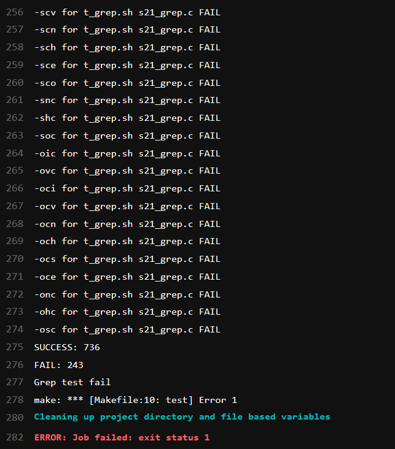

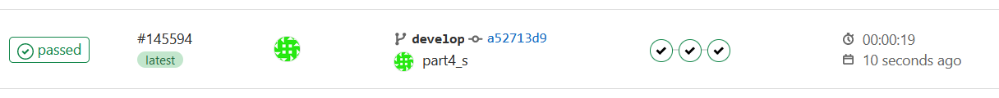
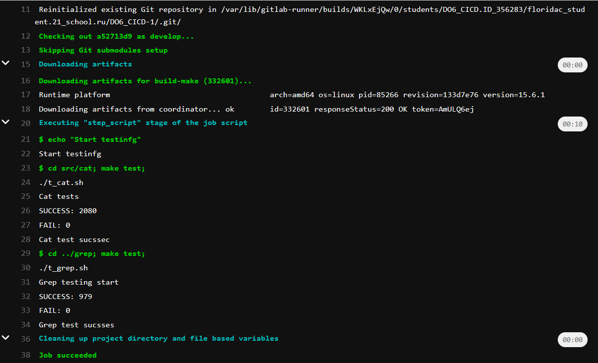

### Part 5. Этап деплоя

**== Задание ==**

##### Поднять вторую виртуальную машину *Ubuntu Server 20.04 LTS*
Самый сложный этап. Пойдем по-порядку:
1. Написать нетпланы для каждой машины

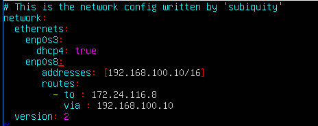
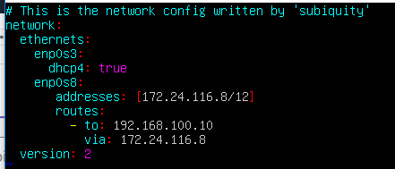

2. Обязательно не забыть изменить `nameservice` на `8.8.8.8` в `/etc/resolv.conf`
Для того чтобы различать машины назовем машину с gitlab-runner -> локальным хостом, тут на которую все скидываем -> удаленным хостом
3. Проверить что на обоих машинах стоит ssh `ssh -v`
4. Сгенирировать на всех ключи(то есть на локальной не нужно, мы его уже делали)
5. Передать публичный ключ локальной машины в удаленную `scp ~/.ssh/id_rsa.pub name_remote@ip_remote /home/name_remote`
6. Записать его в `~/.ssh/authorized_keys `
7. Дать необходимый доступ
    7.1. `chmod 755 ~/.ssh`
    7.2. `chmod 644 ~/.ssh/authorized_keys`
8. Перейти внутрь удаленной машины с хоста по ssh( в первый раз он попросит пароль)
    `ssh -l name_remote ip_remote`
Чтобы выйти используйте команду `exit`
9. Запустите ssh agent на локальной машине 
    `ssh-agent $SHELL`
10. Загрузите приватный ключ 
    `ssh-add`
11. Выполните еще раз пункт 8, но теперь вас должно пустить без пароля!
12. Для работы скрипта надо скопировать приватный ключ в репозиторий 
    `cp /root/.ssh/id_rsa /home/name_local/DO6/id_rsa

#### Написать этап для **CD**, который "разворачивает" проект на другой виртуальной машине:
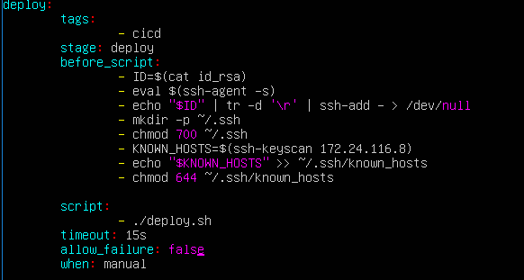
##### Запускать этот этап вручную при условии, что все предыдущие этапы прошли успешно

##### Написать bash-скрипт, который при помощи **ssh** и **scp** копирует файлы, полученные после сборки (артефакты), в директорию */usr/local/bin* второй виртуальной машины
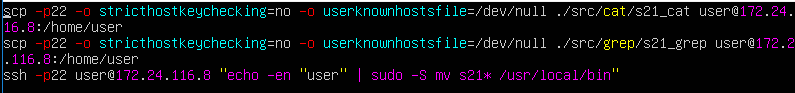
##### В файле _gitlab-ci.yml_ добавить этап запуска написанного скрипта

##### В случае ошибки "зафейлить" пайплайн
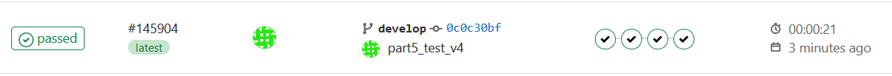
В результате вы должны получить готовые к работе приложения из проекта *C2_SimpleBashScripts* (s21_cat и s21_grep) на второй виртуальной машине.
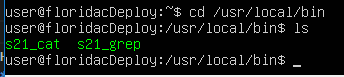
### Part 6. Дополнительно. Уведомления

**== Задание ==**

##### Настроить уведомления о успешном/неуспешном выполнении пайплайна через бота с именем "[ваш nickname] DO6 CI/CD" в *Telegram*

- Текст уведомления должен содержать информацию об успешности прохождения как этапа **CI**, так и этапа **CD**.
- В остальном текст уведомления может быть произвольным.

1. Чтобы создать телеграм-бот надо обратиться к НЕМУ
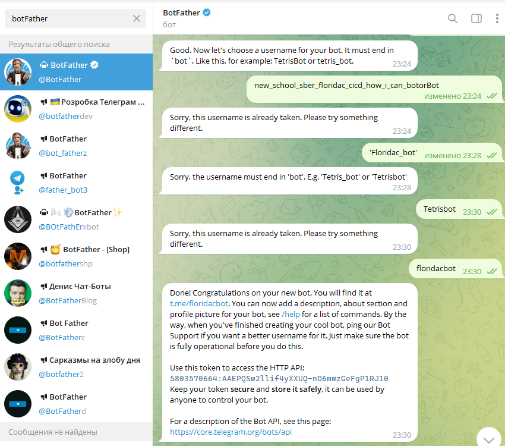
2. После необходимо обновить его
    `https://api.telegram.org/bot{token}/getUpdates`
3. Создать группу и добавить его туда, и повторить пункт два. Там нужно найти ВАШ ID чтобы добавить его в скрипт
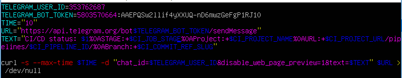
4. Добавить в каждый job в конец script запуск данного скрипта с аргументом PASSED
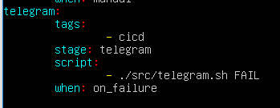

Результат
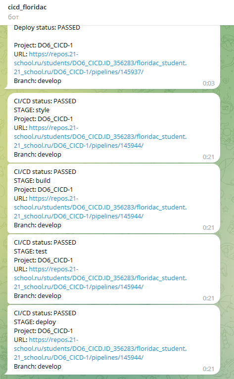 
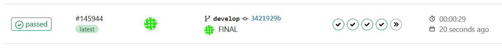

## Список полезных ссылок

- https://stackoverflow.com/questions/32423837/telegram-bot-how-to-get-a-group-chat-id
- https://docs.gitlab.com/ee/ci/yaml/
- https://docs.gitlab.com/ee/ci/ssh_keys/#verifying-the-ssh-host-keys
- https://www.thegeekstuff.com/2008/06/perform-ssh-and-scp-without-entering-password-on-openssh/
- https://linuxize.com/post/how-to-install-virtualbox-guest-additions-in-ubuntu/
- https://docs.gitlab.com/runner/install/linux-manually.html
